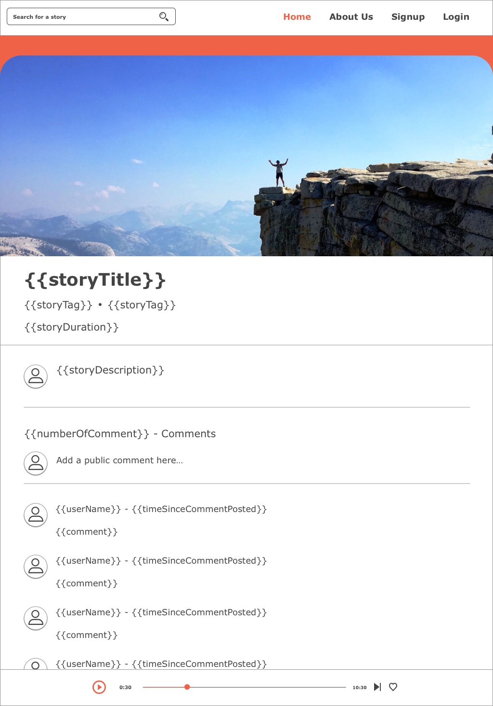

# Story App - Luke, Tess and Max

## URL

## Github Link

  - https://github.com/Stoaree
### Purpose

- Stoaree is an online platform allowing users to share and create compelling interviews easily with another individual based off Mark Howards line of questions. After Mark Howard created his podcast "Howie Games" which has amassed up to 20 million listens he started to get contacted to interview the loved ones of his listeners who were either sick or elderly and to capture their story and how they came to be who they're today. This soon lead to the idea of Stoaree. The purpose of Stoaree is to allow users to easily capture compelling stories from family members, friends or interesting people based off the questions Mark asks in his podcasts. Along with capturing the stories it also becomes a place to share them with the world. A social aspect allowing users to listen to stories around them. Mark wants to also capture the important memories in people's lives and allow them to easily share them amongst family members and store them in one place.

### Functionality / features

- The functionality and features of the application is heavily based around audio and the telling of a story. The functionality of the application is to allow the user to perform the task of recording an story based on the questions asked through the application. Depending on each response by the user will depend on the questions asked through the application. The features of Stoaree will be:

1. Allowing the user to start and stop recordings based on questions seen on the screen,
2. Store stories which they have recorded on their profile,
3. Browse other stories and listen to other stories on the application,
4. Delete stories,
5. Browse other user profiles,
6. Keep stories private if users do not wish to share them,
7. Give stories tags making it easier to search/filter,
8. Search and find particular stories and/or users

### Target audience

- The target audience of Stoaree is between the ages of 40 - 70 both men and women. The target audience currently has a family and has progressed into their career, they now are beginning to think about what they're wanting to leave behind for their family as well as gaining all the information about their parents so their grandchildren can understand who they were as a person and get an understanding of what they went through in their lifetime.

- Though Stoaree is directed at an older demographic, there is a burgeoning younger community involved with podcasts and Youtube. We would like to get them sharing stories and connecting with people of all demographics, providing the service with as many meaningful stories as possible.

### Tech stack

- MERN

1. Node.js
2. Express.js
3. React.js
4. MongoDB / Mongoose

- Heroku - Backend deployment
- Netilfy - Front-end deployment
- AWS - Cloud storage for audio files and images

## Data Flow Diagram

The first diagram is an overview of data flow throughout the whole app, while the other diagrams go into further detail about processes occurring within the app.

## Application Architecture Diagram

## User Stories

- Persona 1:

  - Hi, I'm John a 40 year old, living in Melbourne, Victoria. I'm currently married to my wife Alice and we have twin boys aged 4 and 1 girl aged 7. After recently finding out that my Dad was very sick and only had a number of years to live I became very interested capturing his story so that my children could understand what my Dad was like and how he became who he is today.

    - As John I want to record and capture great stories of loved ones, friends and interesting people so that I can share them amongst family.

    - As John I want to browse and listen to particular stories in my area so that I can expand my knowledge and understanding of what other people have gone through.

    - As John I want to be able to save stories that I like so that I can come back to them at a later date.

    - As John, I want to be able to share stories about my Dad to only my family and friends.

    - As John, I find it hard to ask the right questions so I can get the most information out of my Dad.

    - As John, I want to add tags to my stories so people can easily find them when searching for similar stories.

- Persona 2:

  - Hi, I'm Bridget a 30 year old living in rural Victoria. I'm currently working full time as a receptionist and living with my boyfriend. Having grown up in rural Victoria I have had a yearn to know more about what other people in different parts of the world have gone through. I love understanding how people came to be who they are through their struggles, people they meet and paths they take in life. My dream as a child I wanted to be a journalist travelling around the world discovering stories.

    - As Bridget, I want to browse and listen to particular stories around the world so they I can expand my knowledge and get an understanding of what other people have gone through.

    - As Bridget, I want to save interesting and touching stories so that I can come back and listen to them when I want.

    - As Bridget, I want to be able to share touching and interesting stories with my boyfriend and social network so I can make them aware of what is out there in the world.

    - As Bridget, I want to be able to interview interesting people to create amazing stories.

    - As Bridget, I want to be able to share my stories I create to a global audience quickly and easily.

- Persona 3:

  - Hi, I'm Noah a 15-year-old boy living in metropolitan Melbourne. I'm currently creating my own podcast and launching my Youtube channel and in year 9 VCE. I am looking for ways to develop my interview and presenting persona so I can be a successful content creator in the future. I love watching other content creators and trying to keep up with all the latest podcasts.

    - As Noah, I like that I can use the app to interview people for free and get my content out to the masses.

    - As Noah, Stoaree helps me keep up to date with the latest stories trending on the internet.

    - As Noah, I want to browse the profiles of people with interesting stories so I can see more of their work.

- Persona 4:

  - Hi, I'm Alex, a 50 year old living in Sydney. I have been through several different careers in my life that have taken me across the country and I have learned a lot of things from my experiences. My son (who lives in Melbourne) suggested that I record some of my experiences to share with his colleagues, but I am not well-versed enough with technology to know how to do this on my own.

    - As Alex, I want to be able to record my story through a straightforward and easy-to-use interface so that I don't have to bother with any complicated recording software.

    - As Alex, I want to have questions provided for me so I can more easily organise how to tell my story.

    - As Alex, I want to be able to make my story private because I want more control over who listens to my story.

    - As Alex, I want to be able to easily navigate the app on my smartphone, since I don't own a desktop computer.

## Wire frames for multiple standard screen sizes, created using industry standard software

- For all designs online see: https://sketch.cloud/s/kRppA
- For prototype and interaction with the desktop designs please see: https://sketch.cloud/s/kRppA/a/pnnA8o/play
- For prototype and interaction with the mobile designs please see: https://sketch.cloud/s/kRppA/v/m1kR0k/a/gnnoZz/play

- Note: This application was designed for mobile first.
- Below is the wire frames for a mobile device:

- The below is designs for desktop:

## Screenshots of your Jira board throughout the duration of the project

  